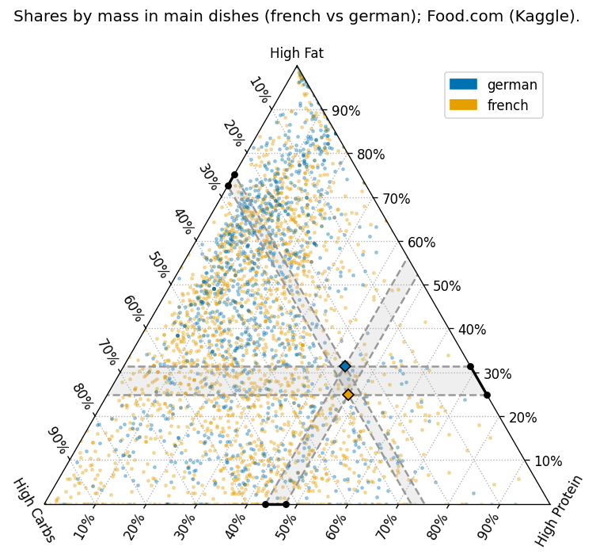
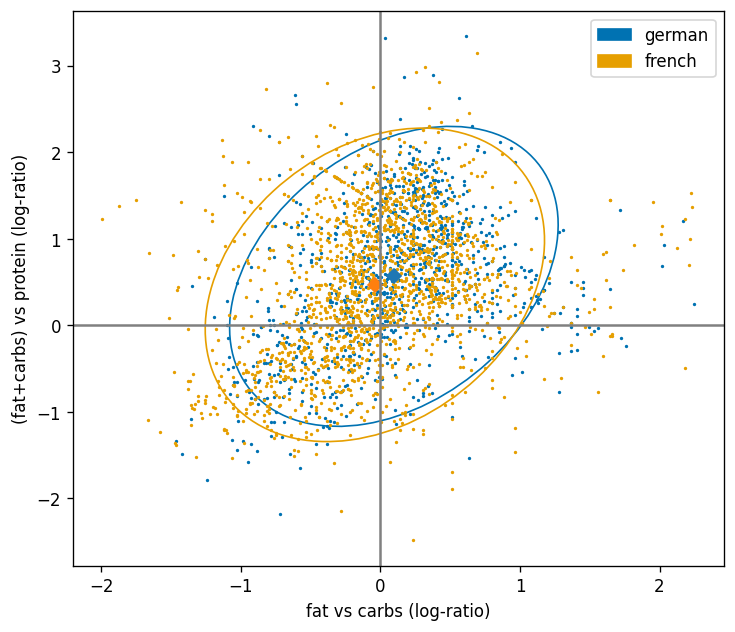

# Main-dish macronutrient composition: French vs German

**Skills used:** compositional data analysis (Aitchison geometry); ternary plotting with `mpltern`; Matplotlib styling & annotation; pandas data wrangling; Aitchison (compositional) centroids; ILR concepts (explained, used to compute centroids); reproducible notebooks; Git data hygiene (no raw data in repo).




---

## Summary

I compared **macronutrient shares** (fat, carb, protein) of **main course** recipes tagged “french” and “german” in the Food.com dataset (Kaggle).

**One-line result:** both cuisines occupy the **same region**; there is a **small, consistent centroid shift**.

* Result (**gram shares**): German minus French centroids ≈ **fat −2.9 pp**, **carbs +5.8 pp**, **protein −2.9 pp**.
  (“pp” = percentage points; numbers vary slightly with preprocessing.)
* Interpretation: the *main-dish pattern* is **more unifying than dividing** in this corpus.



---

## Data

Dataset: **Food.com Recipes and Interactions** by Shuyang Li on Kaggle.

Files used

* `RAW_recipes.csv` (primary; contains `tags` and `nutrition`)

---

### Requirements

```
pandas
numpy
matplotlib
mpltern
ast
```

---

## Methods

* **Preprocessing:** filter to *main course*; compute macro **shares** (by **mass** in this run; energy is available with minimal changes); **close** each row (sum = 1).
* **Ternary plotting:** `mpltern` with 10% grid ticks, centroids (Aitchison means), and annotated **Δ-bands** along axes to show tiny per-component differences.
* **Centroids:** component-wise **geometric means** per cuisine, then **closure** → compositional (Aitchison) mean.
* **ILR view:** map to ILR coordinates to visualize centroid shift and overlap in Euclidean space

---

## Results (short)

* **Large overlap** between “french” and “german” main-dish compositions.
* **Small centroid shift** (example, gram shares): German − French ≈ **fat +2.8 pp**, **carbs -4.8 pp**, **protein +2.0 pp**.
* Communicated as: *“similar overall; tiny, consistent difference.”*

---


## Limitations & caveats

* **User-generated tags** and platform bias; many recipes are localized or adapted.
* **Nutrition** often derives from databases; rounding and DV baselines vary.
* **Imbalanced counts** across cuisines
* **Consistent with intake data** Findings of intake data for France and Germany shows a similar shift

---

## Acknowledgements

* Inspired by Nicola Rennie’s cuisine composition visual.
* Data: Food.com via Kaggle (Shuyang Li).

---

## License

* Code and figures: MIT
* **Data** remain under their original Kaggle terms; do **not** redistribute raw dumps in this repository.

---

## Contact

Questions or ideas? Please open an issue or reach out via LinkedIn.
